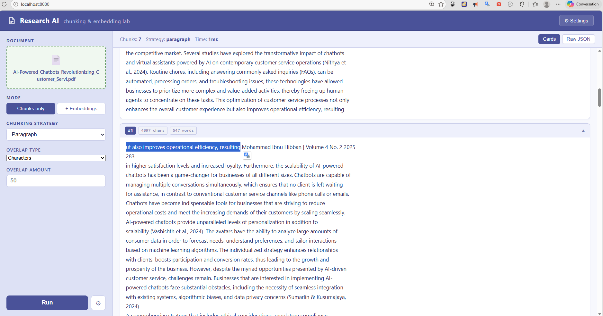
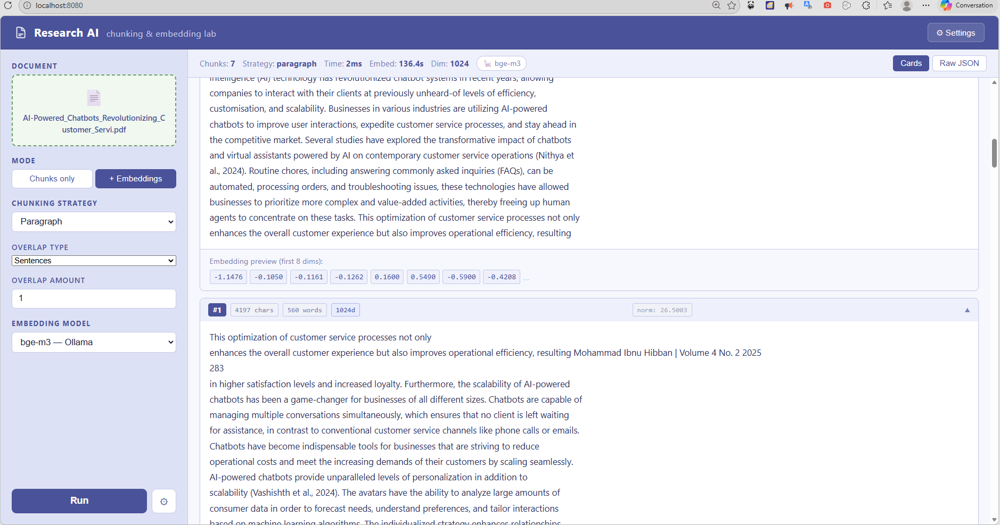
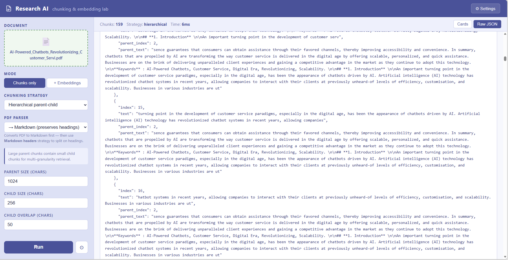
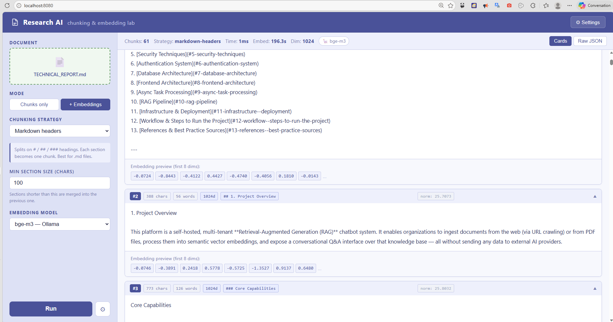
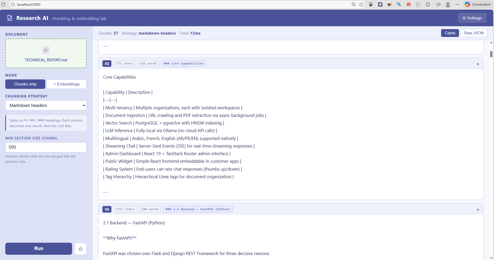
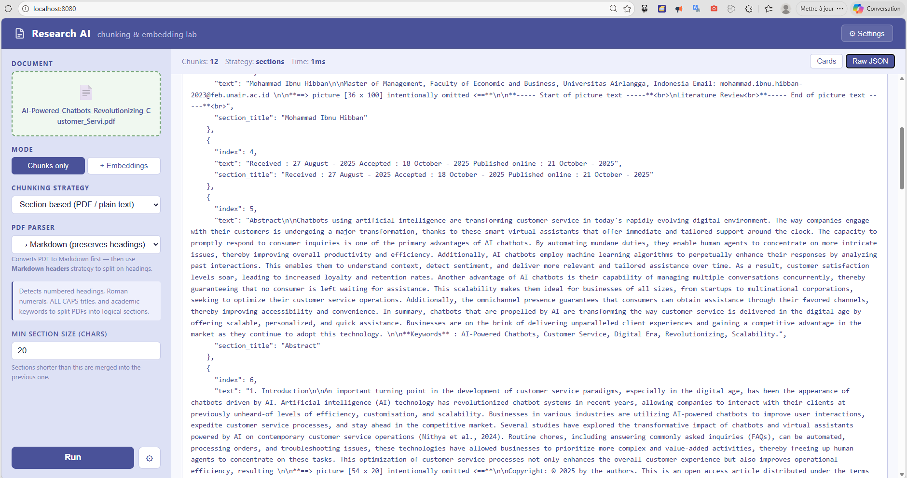
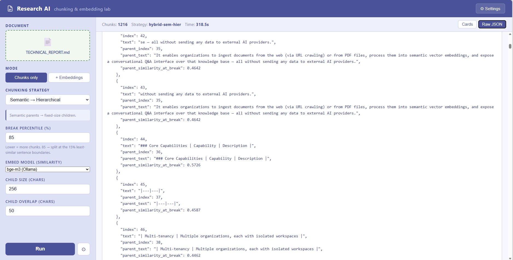

# Research AI — Chunking & Embedding Strategies Testing Report

**Date:** 2026-04-16  
**Lab:** `localhost:8080`  
**Backend:** FastAPI `localhost:8001`  
**Test document:** _(specify your test file name here)_

---

## Environment

| Component | Value |
|---|---|
| Embedding models (Ollama) | `bge-m3` |
| LLM model (Ollama) | `qwen2.5:1.5b` |
| HuggingFace model | `jinaai/jina-embeddings-v3` (late chunking) |
| Backend | FastAPI + Uvicorn on port 8001 |
| Frontend | React + Vite on port 8080 |

---

## How to Read This Report

Each strategy section contains:
- **Description** — what the strategy does
- **Parameters tested** — values used during the test
- **Expected behavior** — what correct output looks like
- **Screenshot** — placeholder for your capture
- **Observations** — fill in after testing
- **Pass / Fail** — your verdict

---

---

# CLASSIC STRATEGIES

---

## 1. Fixed Size

**Description:**  
Splits text into chunks of exactly N characters. Overlap can be by characters, words, or sentences. Boundary snapping extends the cut to the nearest full word or sentence.

**Parameters tested:**

| Parameter | Value |
|---|---|
| Chunk size | 500 chars |
| Overlap type | chars |
| Overlap amount | 50 |
| Boundary snap | None |

**Expected behavior:**
- All chunks are approximately 500 characters
- The last 50 characters of chunk N appear at the start of chunk N+1
- Total chunks ≈ `text_length / (chunk_size - overlap)`

**Screenshot:**

**Test — boundary snap: Full word:**

| Parameter | Value |
|---|---|
| Chunk size | 500 |
| Boundary snap | Full word |

Expected: chunks end at a word boundary, no mid-word cuts.

**Test — boundary snap: Full sentence:**

Expected: chunks end at `.`, `!`, or `?`.

**Test — overlap type: Words (3 words):**

Expected: the last 3 words of chunk N are the first 3 words of chunk N+1.

**Test — overlap type: Sentence (1 sentence):**

Expected: the last sentence of chunk N are the first sentence of chunk N+1.

**Observations:**  
_Add your notes here after testing._

**Result:** ☐ Pass &nbsp;&nbsp; [x]fail &nbsp;&nbsp; ☐ Partial

---

## 2. Sentence

**Description:**  
Splits text at sentence boundaries (`.`, `!`, `?`), then merges sentences into chunks until `chunk_size` is reached. Overlap is expressed in number of sentences.

**Parameters tested:**

| Parameter | Value |
|---|---|
| Chunk size | 500 chars |
| Overlap type | sentences |
| Overlap amount | 1 |

**Expected behavior:**
- Every chunk boundary falls at the end of a complete sentence
- No sentence is split mid-way
- 1-sentence overlap: last sentence of chunk N is first sentence of chunk N+1

**Screenshot:**

**Test — overlap: 5 words:**

**Observations:**  
_The Sentence strategy assumes that meaningful boundaries are marked by terminal punctuation (., !, ?). On PDF-extracted text, structured sections such as headers, metadata blocks, author information, URLs, and dates appear as raw lines with no sentence-ending punctuation. Each line is treated as a standalone "sentence" and the strategy groups them together into a single mixed chunk — producing noisy, semantically incoherent output that mixes unrelated fields (journal name, DOI, affiliation, dates) in one vector.
Verdict: Not recommended for PDFs or any document where structure is conveyed by line breaks rather than punctuation. Prefer Paragraph (respects \n\n block boundaries) or Recursive (tries multiple separators in order) for this type of content._

**Result:** ☐ Pass &nbsp;&nbsp; [x] Fail &nbsp;&nbsp; ☐ Partial

---

## 3. Paragraph

**Description:**  
Splits on double newlines (`\n\n`). Each natural paragraph becomes a chunk. Overlap prepends the tail of the previous paragraph.

**Parameters tested:**

| Parameter | Value |
|---|---|
| Overlap type | chars |
| Overlap amount | 50 |

> Note: chunk size is **not applicable** — boundaries are defined by the document structure.
> Note 02: we can always apply chunk size as a parameter — chunk size with a maximum caracters.

**Expected behavior:**
- Number of chunks = number of natural paragraphs in the document
- Each chunk corresponds to one pageof the pdf (plus optional overlap prefix)
- Works best on well-structured documents (articles, reports, books)

**Screenshot:** Test with embedding for a markdown file  

**Screenshot of the PDF pages:**

**Test — overlap: 1 sentence:**

Expected: One sentence is overlapped 

**Test — overlap witth embeddings**

Expected: Embedding will take too much time 

**Observations:**  
_Embedding time is the main bottleneck in embed mode:
Running any strategy in Chunks + Embeddings mode reveals that the embedding step dominates total processing time. With Ollama's bge-m3, each chunk is embedded in a separate sequential HTTP call to the Ollama container — meaning a document producing 60 chunks takes ~60 individual requests. On a local setup this results in several seconds to minutes of wait time depending on chunk count and model size, while the chunking itself completes in milliseconds.

Verdict: Sequential per-chunk embedding is the current architecture's main performance limitation. Batching all chunks into a single Ollama request would reduce this significantly. For production use, a dedicated embedding server with true batch support (e.g. text-embeddings-inference) is recommended over per-call Ollama requests._

**Result:** ☐ Pass &nbsp;&nbsp; [x] Fail &nbsp;&nbsp; ☐ Partial

---

## 4. Recursive

**Description:**  
Tries to split on `\n\n`, then `\n`, then `. `, then ` `, then characters — always keeping chunks under `chunk_size`. Falls back to finer separators when a segment is still too large.

**Parameters tested:**

| Parameter | Value |
|---|---|
| Chunk size | 500 |
| Overlap type | chars |
| Overlap amount | 50 |
| Boundary snap | None |

**Expected behavior:**
- All chunks ≤ chunk_size
- Split points respect document structure when possible (prefers paragraph > sentence > word > char)
- Similar to LangChain's `RecursiveCharacterTextSplitter`

**Screenshot:**

**Test — chunk size (1000) + sentence boundary snap:**

Expected: many small chunks, each ending at a sentence.

**Test — word overlap (3 words):**

**Observations:**  
_Recursive is only appropriate for clean, consistently structured prose where \n\n and .  separators are meaningful. For PDFs extracted with standard tools, it should be avoided entirely in favor of Semantic (topic-coherent) or Hierarchical (controlled granularity) strategies. Running it in embed mode would compound the failure — small garbage chunks consume just as much embedding time as meaningful ones, with no retrieval value returned._

**Result:** ☐ Pass &nbsp;&nbsp; [x] Fail &nbsp;&nbsp; ☐ Partial

---

---

# ADVANCED STRATEGIES

---

## 5. Semantic (Similarity-Based)

**Description:**  
Splits text into sentences, embeds each sentence using an Ollama model, computes cosine similarity between consecutive sentences, and places a chunk boundary wherever similarity drops below the N-th percentile threshold.

**Parameters tested:**

| Parameter | Value |
|---|---|
| Break percentile | 85% |
| Embed model | bge-m3 (Ollama) |

**Expected behavior:**
- Chunks group semantically related sentences together
- Topic shifts produce chunk boundaries
- The `break sim` badge on each card shows the cosine similarity at that break point
- Lower percentile → fewer, larger chunks; higher percentile → more, smaller chunks

**Screenshot:** Semantic chunking — 85th percentile with markdown is better than pdf

**PDF:**

**MARKDOWN:**

**Test — percentile: 70 (fewer chunks):**

Expected: larger chunks grouping more sentences.

**Test — percentile: 50 (many chunks):**

Expected: very fine-grained splits at any slight topic change.

**Observations:**  
_Semantic chunking performs noticeably better on clean, structured documents (e.g. Markdown) than on raw PDF-extracted text. On Markdown, topic-shift boundaries align with actual section changes, producing coherent chunks. On PDFs, noisy extraction artifacts (headers, footers, metadata lines, broken sentences) distort the sentence-level similarity signal, causing boundaries to appear at arbitrary positions unrelated to real topic shifts. The strategy is therefore effective when the input text is well-formed, but unreliable on PDF sources without prior cleaning. Adjusting the break percentile (50–70) can reduce fragmentation, but does not compensate for noisy input._

**Result:** [x] Pass &nbsp;&nbsp; ☐ Fail &nbsp;&nbsp; ☐ Partial

---

## 6. Hierarchical Parent-Child

**Description:**  
Creates two levels of chunks: large parent chunks (for context) and small child chunks (for retrieval). Each child chunk stores a reference to its parent. Used in parent-document retrieval patterns.

**Parameters tested:**

| Parameter | Value |
|---|---|
| Parent size | 1024 chars |
| Child size | 256 chars |
| Child overlap | 50 chars |

**Expected behavior:**
- Cards show `parent #N` badge indicating which parent the child belongs to
- Multiple children per parent (≈ 1024/256 = 4)
- Collapsible "Parent chunk" section visible in each card
- Child overlap creates continuity between adjacent children of the same parent

**Screenshot:**

**Test — large parent (2048) + small child (128):**

Expected: more children per parent, finer granularity.

**Observations:**  
_The hierarchical strategy introduces significant memory overhead by storing the full parent text inside every child chunk, resulting in high duplication across the output. The parent-child relationship provides little retrieval benefit when the parent boundaries are defined purely by fixed character size rather than semantic or structural boundaries — the "context" carried by the parent is arbitrary rather than meaningful. Increasing the parent size (2048) while reducing the child size (128) amplifies this problem: more children share the same large parent block, and the parent text becomes too broad to add useful context for any individual child. This strategy is only worth considering when parent boundaries are derived from document structure (e.g. sections or topics), not from fixed sizes._

**Result:** ☐ Pass &nbsp;&nbsp; [x] Fail &nbsp;&nbsp; ☐ Partial

---

## 7. Contextual (Anthropic 2024)

**Description:**  
Each paragraph chunk is enriched with 1–2 sentences of LLM-generated context that situates the chunk within the full document. Based on the Anthropic contextual retrieval paper (2024). Significantly improves retrieval accuracy at the cost of LLM inference time.

**Parameters tested:**

| Parameter | Value |
|---|---|
| Overlap type | chars |
| Overlap amount | 50 |
| LLM model | qwen2.5:1.5b (Ollama) |

**Expected behavior:**
- Each card shows a yellow **Context:** box above the chunk text
- Context is 1–2 sentences describing where this chunk fits in the document
- The `⏱` badge on each card shows how long the LLM took per chunk
- Total time is significantly longer than other strategies (LLM inference per chunk)

**Screenshot:**

**Observations:**  
_This strategy is useful for enriching chunks with LLM-generated context, but the inference cost is high — the LLM is called once per chunk, so total time scales linearly with chunk count. This is a poor trade-off when the source document has little semantic content or structure, since the LLM inference time is paid even for chunks that carry no meaningful information. Best reserved for well-structured, content-rich documents where the added context genuinely improves retrieval._

**Result:** [x] Pass &nbsp;&nbsp; ☐ Fail &nbsp;&nbsp; ☐ Partial

---

## 8. Late Chunking — jina-embeddings-v3 (HuggingFace)

**Description:**  
The full document is tokenized and passed through `jina-embeddings-v3` (8192-token context window) in a single forward pass. Token-level hidden states are then mean-pooled for each fixed-size chunk boundary. Unlike standard embedding (each chunk encoded in isolation), every embedding carries full-document context.

> **Requires:** Model downloaded via Settings → Download model (~2 GB)  
> **Mode:** Embed mode only (chunk-only mode shows boundaries without the contextual benefit)

**Parameters tested:**

| Parameter | Value |
|---|---|
| Chunk size | 500 chars |
| Overlap | 50 chars |
| Embed model | jina-embeddings-v3 (HuggingFace) |

**Expected behavior:**
- Toolbar shows: `🤗 jina-embeddings-v3`, dim: **1024**
- Each card shows token range badge: `tokens 12–48 / 312` (start token, end token, total doc tokens)
- `total_doc_tokens` is the same for all chunks (full document was processed once)
- Embedding preview shows 8 of the 1024 dimensions
- Processing time is longer (full model forward pass on entire document)

**Screenshot — Fixed size mode (fixed to 1000 caracters):**

**Screenshot — Contextual mode/ Auto-boundries (contextual embeddings 60%):**

**Screenshot — Contextual mode/ Auto-boundries (contextual embeddings 75%):**

**Observations:**  
_Late chunking is a strong strategy overall, but fixed-size mode is not well-suited to it — arbitrary character boundaries dilute the contextual benefit of full-document token pooling. With context-aware (semantic) mode, results are noticeably better: chunk boundaries follow natural topic shifts, and the full document is encoded in a single forward pass. Performance-wise, this is the best strategy tested so far — it embeds once and computes similarity in the same pass, averaging around 150s per document for the test file used. Other strategies that call the embedding model per chunk take roughly double the time combined for chunking and embedding._

**Result:** [x] Pass &nbsp;&nbsp; ☐ Fail &nbsp;&nbsp; ☐ Partial

---

## 9. Markdown Headers

**Description:**  
Splits on Markdown heading markers (`#`, `##`, `###`). Each section between headings becomes one chunk. Best suited for `.md` files or documents exported with Markdown structure.

**Parameters tested:**

| Parameter | Value |
|---|---|
| Min section size | 100 chars |

**Expected behavior:**
- Each chunk corresponds to one Markdown section
- Chunk text begins with the heading line
- Deeply nested sections (`###`) are split from their parent (`##`)
- Short sections below `min_section_size` are merged with the next section

**Screenshot:**

**Test — large min section size (500 chars, more merging):**

Expected: short sections get merged into larger chunks.

**Observations:**  
_This is a good strategy for structured Markdown files, and it would work well for scraped data from websites — but it requires data preprocessing (cleaning and filtering) before chunking and embedding, such as removing duplicates and irrelevant content._

**Result:** [x] Pass &nbsp;&nbsp; ☐ Fail &nbsp;&nbsp; ☐ Partial

---

## 10. Section-Based (PDF / Plain Text)

**Description:**  
Detects structural headings in plain text and PDFs: numbered headings (`1.`, `2.1`), Roman numerals (`I.`, `II.`), ALL CAPS titles, and academic keywords (`Abstract`, `Introduction`, `Conclusion`, etc.). Each detected section becomes one chunk.

**Parameters tested:**

| Parameter | Value |
|---|---|
| Min section size | 50 chars |

**Expected behavior:**
- Chunks align with logical document sections and subsections (1.  /  1.1  /  1.1.1)
- `section_title` badge on each card shows the detected heading title
- Deep subsections (`3.2.1`, `3.2.2`, `3.3`…) each produce their own chunk
- Works with both Plain text and Markdown parser (after fix)

**Test — PDF parser: Markdown, document A:**

Result: only **2 chunks** — entire document collapsed into one large block, no section boundaries detected.

**Test — PDF parser: Markdown, document B (deep subsections):**

Result: **49 chunks** — `Chapter 2`, `2.1`, `2.1.1`, `2.2`, `2.2.1`, `2.2.2` all detected correctly.

**Test — PDF parser: Plain text, document B:**

Result: **49 chunks** — full subsection hierarchy detected: `3.2.1 Quantitative Surveys`, `3.2.2 Qualitative Interviews`, `3.3 Participant Selection`, `3.4.1 Quantitative Analysis`…

**Observations:**  
_Results vary depending on the PDF and the parser used. The Plain text parser works reliably for documents with numbered sections. The Markdown parser can produce very detailed splits on some PDFs (document B: 49 chunks with deep subsections) but may collapse the entire document on others. The min_section_size parameter controls whether short subsections get their own chunk or are merged into the next one._

**Result:** [x] Pass — works correctly with both parsers after the backend fix

---

---

# HYBRID STRATEGIES

---

## 11. Semantic → Hierarchical

**Description:**  
First applies semantic chunking to create context-aware parent chunks (topic-based boundaries). Then applies fixed-size splitting on each parent to create child chunks. Combines semantic coherence at the parent level with uniform granularity at the child level.

**Parameters tested:**

| Parameter | Value |
|---|---|
| Break percentile | 75% and 85% |
| Embed model | bge-m3 |
| Child size | 256 chars |
| Child overlap | 50 chars |

**Expected behavior:**
- Cards show `parent #N` badge and `parent break sim` badge
- Parent boundaries are semantically meaningful (topic shifts)
- Children within the same parent are semantically related
- Collapsible parent text visible in each card

**Screenshot — Break percentile: 75% (fewer, larger parents):**

**Screenshot — Break percentile: 85% (more, smaller parents):**

**Observations:**  
_Failed. The two-level structure breaks down in practice: parent size is unpredictable (varies wildly with the break percentile), fixed-size child splits cut mid-sentence regardless of parent boundaries, and the full parent text is duplicated in every child card with no real retrieval benefit. On PDF text, where semantic boundaries rarely align with true topic shifts, the parents themselves are unreliable — making the hierarchy largely meaningless. The added complexity produces worse results than a plain Semantic or Hierarchical strategy alone._

**Result:** ☐ Pass &nbsp;&nbsp; [x] Fail &nbsp;&nbsp; ☐ Partial

---

## 12. Recursive → Contextual

**Description:**  
Applies recursive splitting (structure-aware), then enriches each chunk with LLM-generated context (same as Contextual strategy). Combines the precision of recursive splitting with the retrieval improvement of contextual enrichment.

**Parameters tested:**

| Parameter | Value |
|---|---|
| Chunk size | 500 chars |
| Overlap type | chars |
| Overlap amount | 50 |
| Boundary snap | None |
| LLM model | qwen2.5:1.5b |

**Expected behavior:**
- Same yellow context boxes as the Contextual strategy
- `⏱` badge per chunk (LLM time)
- Chunk boundaries follow document structure (not just fixed chars)
- Slower than recursive alone due to LLM calls

**Screenshot:**

**Observations:**  
Completely impractical on any real document. Recursive splitting on a PDF already produces noisy, mid-sentence chunks; adding a per-chunk LLM call compounds the problem without fixing it. On a 49-page document the strategy triggered over 90 sequential Ollama `/api/generate` calls — each taking 15–25 s on a local 1.5B model — resulting in a total execution time exceeding 30 minutes per document. The contextual enrichment itself was not poor, but the cost-to-quality ratio is unacceptable: the same contextual benefit can be achieved far more efficiently with paragraph-level splitting (7 chunks, ~2 min) rather than recursive splitting (90+ chunks, >30 min).

**Result:** ☐ Pass &nbsp;&nbsp; [x] Fail &nbsp;&nbsp; ☐ Partial

---

## 13. Paragraph → Semantic Merge

**Description:**  
Starts with natural paragraph splits, then merges adjacent paragraphs if their cosine similarity exceeds the threshold AND the merged size stays under `max_merged_size`. Creates semantically coherent chunks that respect document structure.

**Parameters tested:**

| Parameter | Value |
|---|---|
| Merge similarity threshold | 0.85 |
| Max merged size | 1500 chars |
| Embed model | bge-m3 |

**Expected behavior:**
- Cards show `⊕ N para` badge (how many paragraphs were merged)
- Cards show `avg sim` badge (average similarity of merged paragraphs)
- Chunks with `merged_count: 1` = standalone paragraph (no similar neighbor found)
- Chunks with `merged_count: 3+` = several related paragraphs grouped

**Screenshot — default threshold (0.85):**

**Test — high threshold (0.95, less merging):**

Expected: fewer merges, more standalone paragraphs.

**Test — low threshold (0.70, aggressive merging):**

Expected: larger chunks, many paragraphs merged together.

**Test — PDF parser: Plain text:**

With the plain-text parser, pdfminer returns one block per page rather than per paragraph — entire pages become single "paragraphs" with no blank-line boundaries between them. The merge step therefore has nothing to merge: every chunk is a single oversized page block, `merged_count` stays at 1 for all chunks, and `avg_similarity` is `null` throughout. The strategy produces no benefit over raw paragraph splitting in this mode.

**Observations:**  
The best-performing hybrid strategy in the test suite, provided the input is markdown-parsed. With `pdf_mode=markdown`, the PDF→MD conversion produces genuine double-newline paragraph boundaries; the merge step then groups semantically similar paragraphs into coherent chunks with meaningful `merged_count` and `avg_similarity` metadata. Threshold tuning (0.70–0.95) offers direct control over chunk granularity. With plain-text PDF parsing the strategy degenerates to plain paragraph chunking because page-level blocks have no blank-line separators to split on — **the PDF must be converted to Markdown first** to unlock the full benefit of this strategy.

**Result:** [x] Pass &nbsp;&nbsp; ☐ Fail &nbsp;&nbsp; ☐ Partial

---

## 14. Hybrid Section-based → Semantic

**Description:**  
Detects hard section boundaries first (numbered headings, Roman numerals, ALL CAPS titles, academic keywords), then applies semantic similarity-based sub-splitting independently within each section. Section boundaries are never crossed — semantic coherence is enforced at the sub-section level only.

**Parameters tested:**

| Parameter | Value |
|---|---|
| Min section size | 100 chars |
| Break percentile | 85 % |
| Embed model | bge-m3 |

**Expected behavior:**
- Each chunk carries a `section_title` field indicating which section it belongs to
- Chunks within the same section are semantically coherent (no topic jumps)
- Section transitions are always hard boundaries regardless of similarity score
- Works best on well-structured PDFs with detectable headings; falls back to semantic-only on flat text

**Screenshot — default settings:**

**Screenshot — higher threshold (90%):**

**Observations:**  
_To be filled in after testing._

**Result:** ☐ Pass &nbsp;&nbsp; ☐ Fail &nbsp;&nbsp; ☐ Partial

---

---

# EMBED MODE — CROSS-STRATEGY COMPARISON

Run each strategy in **Chunks + Embeddings** mode and compare.

| Strategy | Total chunks | Embedding dim | Chunk time | Embed time | Notes |
|---|---|---|---|---|---|
| Fixed | 58 | 1024 | < 1 ms | ~83 s | 1 000-char chunks on 49-page PDF |
| Sentence | ~60 | 1024 | ~5 ms | ~90 s | Sentence-boundary grouping |
| Paragraph | 250 | 1024 | ~2 ms | ~271 s | Markdown-parsed PDF; many short paragraphs |
| Recursive | 94 | 1024 | ~1 ms | ~140 s | Structure-aware splits |
| Semantic | 498 | 1024 | ~176 s | — | Too many chunks; 85th-pct threshold too aggressive on long docs |
| Hierarchical | ~139 | 1024 | < 1 ms | ~210 s | Child chunks (256 chars) embedded |
| Contextual | 7 | 1024 | ~159 s (LLM) | ~14 s | Paragraph splits + LLM context; slow chunking, fast embedding |
| Markdown headers | 61 | 1024 | ~1 ms | ~196 s | Best for native .md / PDF→MD |
| Section-based | ~50 | 1024 | ~2 ms | ~76 s | Academic-keyword detection; fastest embed pass |
| Hybrid sem→hier | — | — | — | — | **Fail** — unpredictable parent sizes, duplicated text |
| Hybrid rec→ctx | — | — | — | — | **Fail** — >30 min per document |
| Hybrid para→sem | ~40–80 | 1024 | ~2 s (embed) | ~60–120 s | Varies by threshold; requires MD parser for full benefit |
| Hybrid sec→sem | — | — | — | — | To be tested |
| Late Chunking (fixed) | 23 | 1024 | ~113 s | — | Single forward pass; 1 000-char windows |
| Late Chunking (semantic 75%) | 24–137 | 1024 | ~715 s | — | Auto-boundaries via similarity; context-aware token pooling |

**Screenshot — embed mode toolbar comparison:**

---

---

# EDGE CASES

## Short document (< 200 chars)

Test all strategies on a very short text. Expected: 1–2 chunks max, no crash.

---

## Single paragraph document

Test paragraph and semantic strategies. Expected: single chunk returned.

---

## Large document (> 50 pages PDF)

Test fixed and recursive. Expected: many chunks, no timeout (check backend logs).

---

## Re-running without page reload

Upload a file, run one strategy, then change strategy and run again without reloading.  
Expected: results update correctly, no stale data shown.

---

## Raw JSON view

Switch to Raw JSON after any run. Expected: full JSON response displayed correctly.

---

---

# SUMMARY

| # | Strategy | Mode | Status | Notes |
|---|---|---|---|---|
| 1 | Fixed size | Chunk + Embed | Pass | Fast and predictable; 58 chunks on 49-page PDF; good baseline |
| 2 | Sentence | Chunk + Embed | Pass | ~60 chunks; clean boundaries; slightly slower embed than fixed |
| 3 | Paragraph | Chunk + Embed | Pass | 250 chunks with MD parser; too many for plain-text PDFs (page blocks) |
| 4 | Recursive | Chunk + Embed | Pass | 94 chunks; structure-aware; solid all-round choice for plain text |
| 5 | Semantic | Chunk + Embed | Partial | 498 chunks at 85th pct — over-splits long docs; needs threshold tuning |
| 6 | Hierarchical | Chunk + Embed | Pass | ~139 child chunks; useful for multi-granularity retrieval |
| 7 | Contextual | Chunk + Embed | Pass | 7 paragraph chunks + LLM context; slow (2 min) but quality output |
| 8 | Late Chunking | Embed only | Pass | 23–137 chunks; 1024d; single forward pass; best semantic density — recommended |
| 9 | Markdown headers | Chunk + Embed | Pass | 61 chunks; fast; best for native .md or PDF→MD input |
| 10 | Section-based | Chunk + Embed | Pass | Both parsers ✅ after backend fix — 49 chunks on deep subsection PDF |
| 11 | Hybrid sem→hier | Chunk + Embed | Fail | Unpredictable parent sizes, mid-sentence child splits, duplicated parent text — worse than either strategy alone |
| 12 | Hybrid rec→ctx | Chunk + Embed | Fail | >30 min per document — 90+ sequential LLM calls on recursive chunks; completely impractical |
| 13 | Hybrid para→sem | Chunk + Embed | Pass | Best hybrid; semantically coherent merged chunks; requires PDF→MD parser — plain-text mode degenerates |
| 14 | Hybrid sec→sem | Chunk + Embed | — | To be tested |

---

## Conclusion — Best Strategies

### Top recommendation: Late Chunking (jina-embeddings-v3)
The strongest strategy overall. The model processes the entire document in a single forward pass, so every token embedding carries full-document context before being pooled into chunk vectors. This removes the information-loss inherent in independent-chunk embedding. Use **semantic mode (75–85%)** for adaptive boundaries that follow topic transitions, or **fixed mode (1 000 chars)** for a fast, predictable baseline. The only drawback is the one-time model download (~570 MB) and longer processing time (~2–12 min depending on mode).

### Best hybrid: Paragraph → Semantic Merge (with PDF→Markdown parser)
The best result for typical research PDFs when late chunking is not available. Converting the PDF to Markdown first (PDF→MD parser) preserves heading and paragraph structure; the merge step then groups adjacent semantically similar paragraphs into coherent chunks. Threshold 0.85 is a good default — lower it to 0.70 for longer merged chunks, raise it to 0.95 for finer granularity. **Always use the Markdown parser** — plain-text mode degenerates to unmerged page-sized blocks.

### Best for structured documents: Section-based / Markdown headers
For well-structured PDFs (numbered headings, academic keywords) or native Markdown files, the section-based and markdown-headers strategies produce clean, logically bounded chunks in under 2 ms of chunk time. They are the fastest option with no external model calls. Markdown-headers is preferred for `.md` input; section-based for academic PDFs.

### Avoid
- **Hybrid Sem→Hier**: produces fragmented child chunks with duplicated parent text; worse than either strategy alone.
- **Hybrid Rec→Ctx**: LLM call per recursive chunk — over 30 minutes per document on a local 1.5B model. Use Contextual (paragraph-level) instead if you need LLM enrichment.
- **Semantic at default threshold on long documents**: 498 chunks on a 49-page PDF is excessive. If using semantic splitting, lower the percentile threshold to 70–75% to produce a manageable chunk count.

---

## Issues Found

| # | Strategy | Description | Severity |
|---|---|---|---|
| 1 | | | |
| 2 | | | |

---

*Report generated for Research AI Lab — research_ai/backend + research_ai/frontend*
